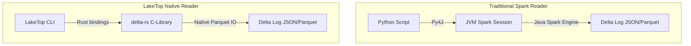

# Architecture and Design Decisions

This document explains the technical choices, components, and design behind LakeTop.

Author: Saketh Kase

---

## Bypassing the PySpark JVM

Standard Delta Lake tools require a JVM and Apache Spark to read and inspect table states. This imposes significant overhead, requiring Java runtimes, classpath setup, and high memory footprints.

To deliver a lightweight CLI utility, LakeTop uses `deltalake` (built on Rust `delta-rs`). Bypassing the JVM offers:
- **Instant Launch**: Starts in milliseconds.
- **Zero Heavy Dependencies**: Avoids installing Java, Spark, or managing Hadoop home configurations.
- **Low Memory Usage**: Runs directly in the native Python process.

---

## The Metadata Parsing Loop

The `LakeTopEngine` performs reads on the `_delta_log/` transaction files.
1. **Transaction Ledger**: The engine fetches history logs. Since Delta transaction logs are JSON files located in `_delta_log/00000000000000000000.json`, etc., the Rust reader parses these files sequentially to reconstruct operation types, timestamps, and metrics.
2. **Active File Index**: To determine table sizing and health, the engine reads the active "add actions" for the latest checkpoint state. It ignores "remove actions" (tombstoned files) to report only the current physical table state.

---

## Layout and Styling Architecture

The interface uses Textual's CSS styling engine (`styles.css`) for high-density terminal layout:
- **Variable Separation**: Custom colors are mapped to unique CSS variables (like `$primary-color` and `$panel-bg`) to avoid overriding Textual's reserved system colors, ensuring compatibility across terminals.
- **Grid Real-Estate**: The main container is split 50/50 vertically. The top row holds two static panels representing configuration and health statistics. The bottom row uses a full-width viewport for table-based history traversal.
